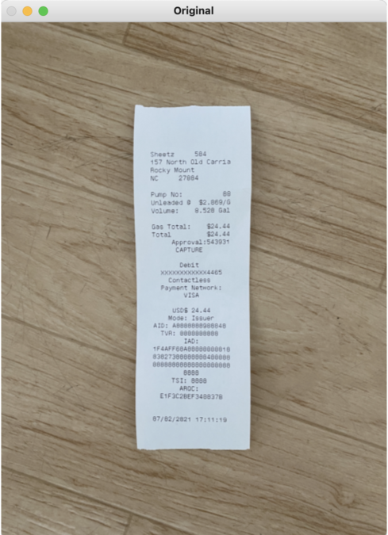
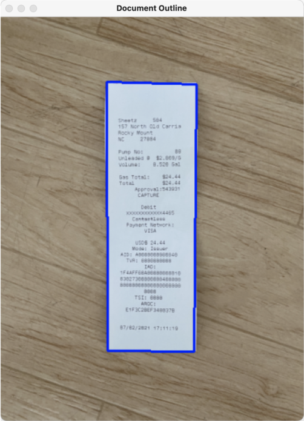
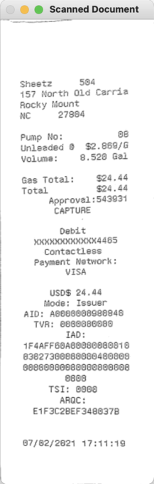

# Simple Document Scanner
### The scanner uses opencv to extract a scan of a document from a given image and saves it as a 
### Usage
```
  pip install -r requirements.txt
  python3 scanner.py -i test_images/receipt.jpg
```
Original Image                     | Document Outline | Scanned Document
:---------------------------------:|:----------------:|:---------------:
 |  | 


